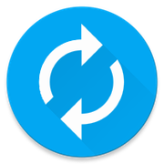

# RenewPass

This is the iOS version of RenewPass, an open-source, cross-platform project that keeps you riding! 🚎🚆

The Android version is developed and maintained by Coffeeboys: https://github.com/Coffeeboys/RenewPass

RenewPass does the work of renewing your UPass for you. Enter your school credentials, and RenewPass will log in to your UPassBC account and request the latest available UPass, all with a single tap. ✅

Your school credentials are stored securely in the iOS keychain, which is encrypted with your iCloud password.

Supported schools (beta testers needed!):
- SFU (tested)
- UBC
- BCIT
- VCC
- KPU
- Emily Carr
- Douglas (tested)
- Langara
- CapU

How do I get RenewPass? 📲 

All feedback is welcome! ❤️ Feel free to submit an issue or open up a pull request.

Disclaimer: 
RENEWPASS MAKES USE OF SERVICES WHICH MAY BE INACCESSIBLE OR UNAVAILABLE AT ANY TIME AND CAN NOT MAKE ANY GUARANTEES REGARDING FUNCTIONALITY. RENEWPASS IS PROVIDED "AS IS" AND "AS AVAILABLE" WITHOUT WARRANTY OF ANY KIND. 

 RenewPass by <a xmlns:cc="http://creativecommons.org/ns#" href="http://kino.codes" property="cc:attributionName" rel="cc:attributionURL">Kino Roy</a> is licensed under a <a rel="license" href="http://creativecommons.org/licenses/by-nc-sa/4.0/">Creative Commons Attribution-NonCommercial-ShareAlike 4.0 International License</a>.
